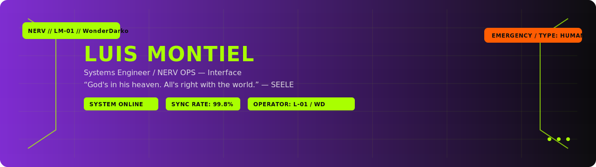
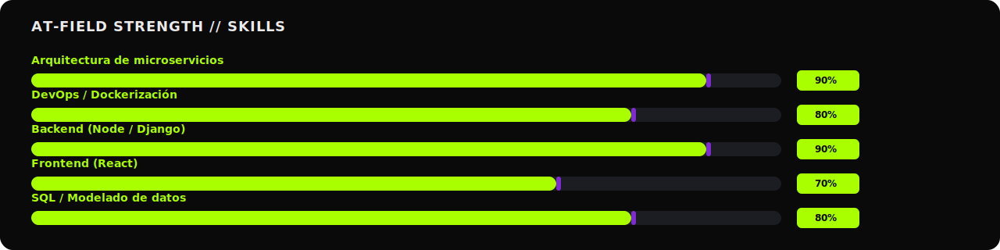
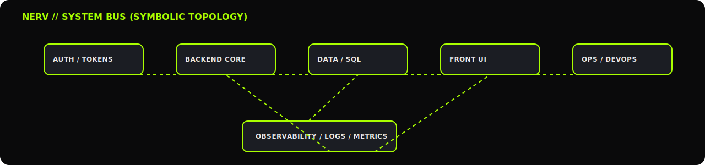

<!-- ====================================================== -->
<!--             NERV // OPERATION INTERFACE                -->
<!-- ====================================================== -->

<p align="center">
<picture>
<source media="(prefers-color-scheme: dark)" srcset="./assets/banner-eva-classic.svg" />
<source media="(prefers-color-scheme: light)" srcset="./assets/banner-emergency.svg" />

</picture>
</p>

<h3 align="center" style="color:#A9FF00; font-weight:800; letter-spacing:2px;">
NERV OPS // EVA INTERFACE CONTROL
</h3>
<p align="center">
<sub style="color:#EAEAEA;">SYSTEMS ENGINEER — NERV OPS DIVISION</sub>
</p>

---

<!-- STATUS ====================================================== -->

<h2 align="center" style="color:#A9FF00; font-weight:700; letter-spacing:1px;">STATUS // SYNCHRONIZATION</h2>

<p align="center">


</p>

---

<!-- DIRECTIVE ====================================================== -->

<h2 align="center" style="color:#A9FF00; font-weight:700;">DIRECTIVE // PROFILE</h2>

<p align="center" style="max-width:760px; margin:auto; color:#EAEAEA;">
<b>LUIS MONTIEL (WonderDarko)</b><br/>
Ingeniero de sistemas con especialización en <b>backend</b> y <b>DevOps</b>.  
Diseño arquitecturas limpias, observables y reproducibles mediante <b>microservicios</b> y <b>contenedores</b>.<br/>
Enfocado en mantener la integridad del sistema y la automatización operativa.
</p>

<p align="center" style="font-style:italic; color:#A9FF00;">
“God's in his heaven. All's right with the world.” — SEELE
</p>

---

<!-- AT-FIELD ====================================================== -->

<h2 align="center" style="color:#A9FF00; font-weight:700;">AT-FIELD STRENGTH // SKILLS</h2>

<p align="center">

</p>

---

<!-- TELEMETRY ====================================================== -->

<h2 align="center" style="color:#A9FF00; font-weight:700;">TELEMETRY // SYSTEM METRICS</h2>

<p align="center">

</p>
<p align="center">

</p>

---

<!-- DIAGRAM ====================================================== -->

<h2 align="center" style="color:#A9FF00; font-weight:700;">SYSTEM BUS // SYMBOLIC TOPOLOGY</h2>

<p align="center">

</p>

---

<!-- PROTOCOL ====================================================== -->

<h2 align="center" style="color:#A9FF00; font-weight:700;">PROTOCOL // OPERATIONAL DIRECTIVES</h2>

<div align="center">

<table style="border-collapse:collapse; width:80%; color:#EAEAEA;">
<tr><td>1.</td><td>Código legible antes que óptimo.</td></tr>
<tr><td>2.</td><td>Despliegues reproducibles (Docker / Portainer / GitOps).</td></tr>
<tr><td>3.</td><td>Observabilidad primero; escalado después.</td></tr>
<tr><td>4.</td><td>Documentación estructurada (Objetivo / Alcance / Criterios / Checklist).</td></tr>
<tr><td>5.</td><td>Estabilidad sobre novedad. Integridad del sistema ante todo.</td></tr>
</table>

</div>

---

<!-- CONTACT ====================================================== -->

<h2 align="center" style="color:#A9FF00; font-weight:700;">CONTACT CHANNELS</h2>

<p align="center">
<a href="mailto:wonder.montiel@gmail.com" style="color:#A9FF00; text-decoration:none;">wonder.montiel@gmail.com</a><br/>
<a href="https://github.com/WonderDarko" style="color:#A9FF00; text-decoration:none;">github.com/WonderDarko</a>
</p>

---

<!-- DEBUG LOG ====================================================== -->

<details>
<summary><b>DEBUG LOG // SYSTEM CHECK</b></summary>

```shell
> NERV OPS INTERFACE: ACTIVE
> USER: LM-01 // AUTHORIZED
> SYNC RATE: 99.8%
> EVA UNIT: ONLINE
> SYSTEM INTEGRITY: 100%
