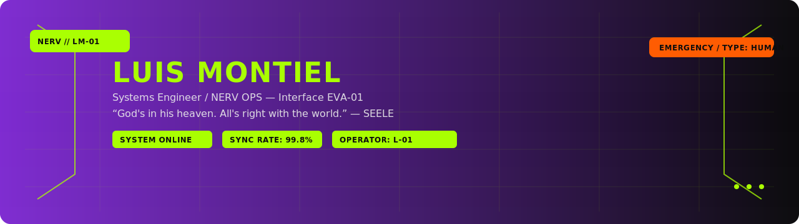
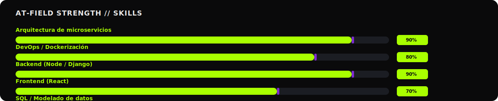
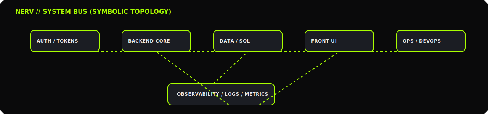

  

<h3 align="center" style="color:#A9FF00; font-weight:800;">NERV OPS // EVA-01 INTERFACE</h3>

  Systems Engineer / NERV OPS — Interface EVA-01

---

### STATUS // Synchronization

  
  
  
  
  
  
  
  
  
  
  

---

## DIRECTIVE // Bio
> Full-stack developer con foco en **backend** (Node/Django) y **contenedores**.  
> Me gusta diseñar **arquitectura limpia de microservicios** y desplegar con **Docker/DevOps**.  
> Actualmente estoy profundizando en **orquestación, observabilidad y automatización**.

---

## AT-FIELD STRENGTH

  

---

## TELEMETRY

  

  

---

## SYSTEM BUS (SYMBOLIC)

  

---

## PROTOCOL
1. Código legible antes que óptimo.
2. Deploys reproducibles (Portainer/GitOps).
3. Observabilidad primero; luego escalado.
4. Documentación con objetivos, alcance, criterios de aceptación y checklist.

---

## CONTACT
- Email: <a href="mailto:wonder.montiel@gmail.com">wonder.montiel@gmail.com</a>

  
<strong>DEBUG LOG</strong> (hover para desplegar)

