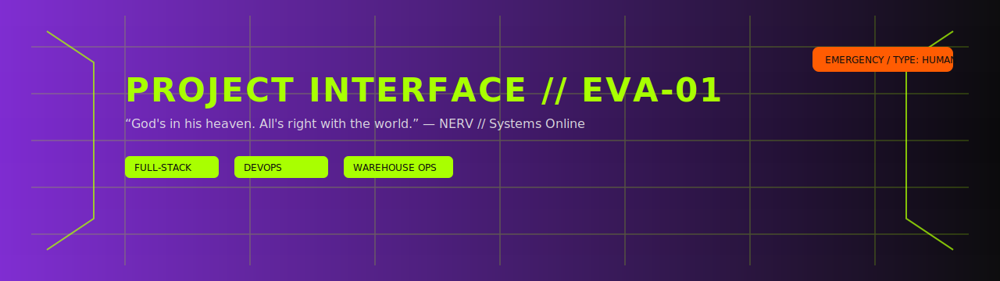

<!-- Banner EVA -->

  

<!-- Título centrado -->
<h3 align="center" style="color:#A9FF00; font-weight:700;">NERV OPS // EVA-01 INTERFACE</h3>

  Sistemas en línea. Monitoreo, surtido, impuestos, bodegas, historia de procesos.

---

### STATUS // Sincronización

  
  
  
  

---

## DIRECTIVA // Objetivo
Estandarizar y operar un ecosistema de microservicios para distribución y almacén:
- **Notas & Historial:** trazabilidad fina por etapa.
- **Surtido:** eficiencia en picking y reimpresión controlada de tickets.
- **Bodegas:** módulos de operación.
- **IEPS / Tasas:** mantenimiento y auditoría de impuestos.

> AT-Field: calidad de código, despliegues reproducibles, observabilidad.

---

## MÓDULOS EN EJECUCIÓN
- `servicio-notas-auth` — JWT/refresh tokens, middlewares de seguridad.
- `surtido-helper` — lógica de picking y helpers.
- `tasas-ieps` — Django REST para tasas y reportes Excel.
- `bodegas` — front React para operación y reportes PDF/Excel.

---

## TECNOLOGÍAS

  
  
  
  
  
  
  
  

---

## TELEMETRÍA

  

  

---

## PROTOCOLOS // Manifiesto
1. Código primero legible, luego óptimo.
2. Deploys vía Portainer + GitOps.
3. Observabilidad y métricas antes de escalar.
4. Documentación con objetivos, alcance, criterios de aceptación y checklist.

---

## CONTACTO DE OPERACIÓN
- Web: pendiente
- Email: contacto@ejemplo.com
- LinkedIn / X: pendiente
